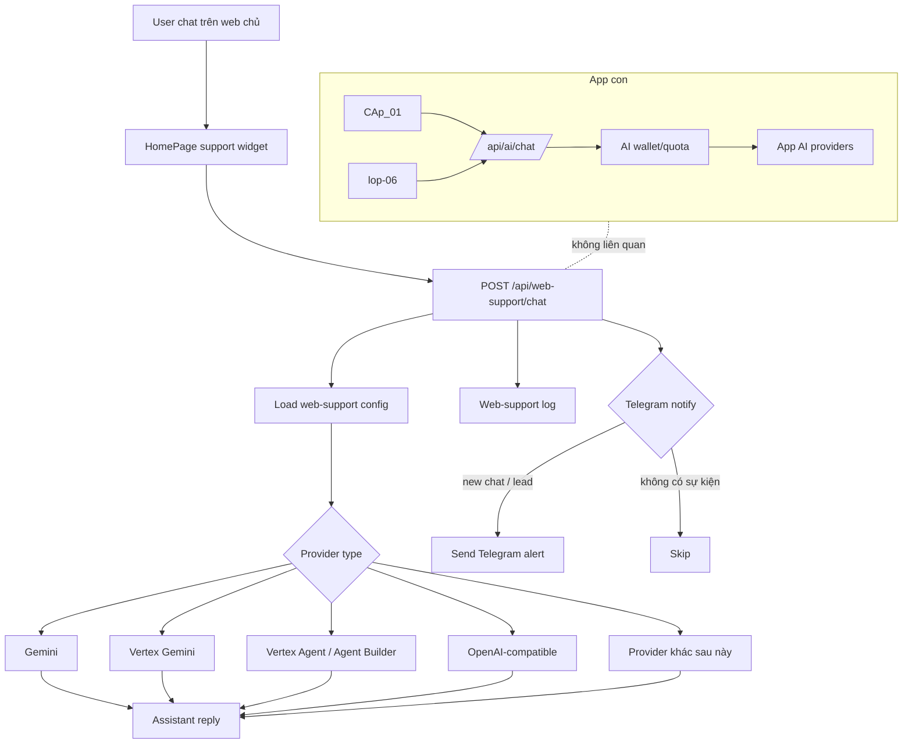

# Web Support Bot Spec

## Mục tiêu

- Web chủ có một luồng AI riêng cho chatbot hỗ trợ.
- Luồng này **không dùng quota** của app con.
- App con `CAp_01` và `lop-06` giữ nguyên AI, wallet và quota hiện tại.
- Web-support phải dễ đổi provider mà không ảnh hưởng phần còn lại của hệ thống.

## Kiến trúc

## Luồng web-support

1. User chat trên web chủ.
2. Frontend gọi `POST /api/web-support/chat`.
3. Backend đọc `web-support config` riêng.
4. Backend chọn provider theo `providerType`.
5. Backend gọi provider tương ứng.
6. Backend lưu log nội bộ.
7. Backend gửi Telegram nếu có `new chat` hoặc `lead`.
8. Frontend chỉ nhận reply và render lên UI.

## Provider type

### 1. `gemini`

- Dùng khi cần chat hỗ trợ thuần, triển khai nhanh.
- Có thể dùng Google AI Studio / Gemini API.
- Phù hợp giai đoạn đầu.

### 2. `vertex_gemini`

- Dùng Gemini qua Vertex AI.
- Hợp nếu muốn đi theo hạ tầng Google Cloud.
- Vẫn là chat model, nhưng quản trị enterprise tốt hơn.

### 3. `vertex_agent`

- Dùng Agent Builder / Agent Engine.
- Hợp khi bot cần:
  - session/memory
  - tool calling
  - workflow hỗ trợ
  - knowledge base / RAG sau này
- Backend nên gọi agent bằng API runtime của Vertex, không gọi trực tiếp từ browser.

### 4. `openai_compatible`

- Dùng cho các API tương thích OpenAI.
- Hữu ích nếu muốn đổi nhà cung cấp sau này.

### 5. `provider_khac`

- Dành cho provider mới về sau.
- Không ảnh hưởng app con.

## Admin UI cần có

- Toggle bật/tắt web-support.
- Chọn `Provider Type`.
- `Base URL`.
- `API Key` hoặc `Auth Token`.
- `Model` hoặc `Agent Resource Name`.
- `System Prompt`.
- `Load Models`.
- `Test Connection`.
- `Telegram Token`.
- `Telegram Chat ID`.
- `Test Telegram`.
- `Log viewer`.
- `Bulk delete logs`.

## Rule Telegram

- Chỉ báo theo sự kiện, không báo từng AI reply.
- Event chính:
  - `new chat`
  - `lead`
- Nếu cùng phiên có cả hai, chỉ gửi một tin gộp.
- Telegram chỉ là kênh báo nhanh, log nội bộ mới là nguồn dữ liệu đầy đủ.

## Rule log

- Lưu toàn bộ chat của web-support vào file log riêng.
- Log phải có:
  - `sessionId`
  - `createdAt`
  - `source`
  - `pageUrl`
  - `visitorName`
  - `visitorEmail`
  - `userMessage`
  - `assistantMessage`
  - `detectedPhones`
  - `detectedEmails`
  - `isLead`
  - `telegramNotificationType`
  - `telegramStatus`
  - `error`
- Admin phải có:
  - chọn từng dòng
  - chọn tất cả
  - xoá hàng loạt

## Fallback

- Nếu provider chính lỗi:
  - user chỉ thấy câu thân thiện kiểu `Hiện các nhân viên đang bận, vui lòng gọi lại sau.`
  - lỗi kỹ thuật chỉ log ở server
- Không được fallback sang AI wallet của app con.
- Không được móc chéo sang `ai-providers.json` của app con.

## Nguyên tắc tách luồng

- `App con`:
  - giữ nguyên AI/quota/wallet hiện tại
  - không đổi route
  - không đổi config
- `Web-support`:
  - có config riêng
  - có log riêng
  - có Telegram riêng
  - có thể đổi provider độc lập

## Khuyến nghị triển khai

### Giai đoạn 1

- `gemini`
- `openai_compatible`

### Giai đoạn 2

- `vertex_gemini`

### Giai đoạn 3

- `vertex_agent`

## Kết luận

Web-support nên là một hệ bot riêng, độc lập hoàn toàn với app con. Cách này giúp dễ kiểm soát, dễ đổi provider, dễ log lead và không làm lộn quota/wallet của hệ AI học tập.
